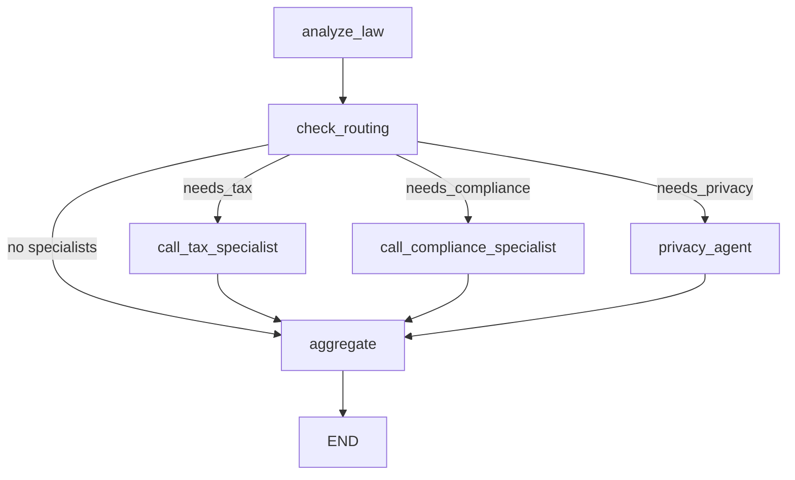
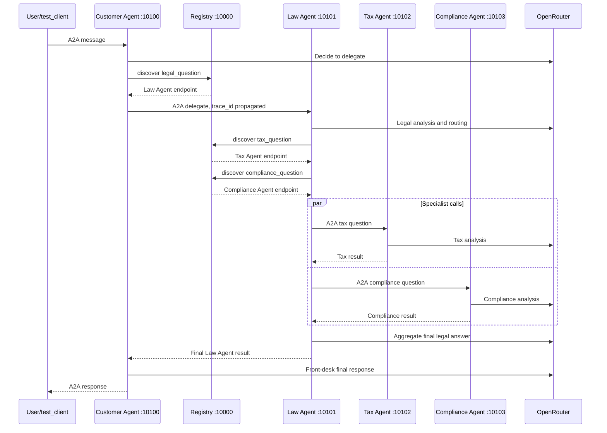

# Lab Report: Multi-Agent MCP/A2A Codelab

## Environment

- Python: 3.11.11
- Dependency environment: `.venv`
- Install command used: `.venv/bin/python -m pip install -e .`
- OpenRouter model: `anthropic/claude-sonnet-4-5`
- Token cap used: `OPENROUTER_MAX_TOKENS=384`

`uv` was not available in the local PATH, so the lab was run with the project virtualenv.

## Part 1: Direct LLM Calling

### Code Questions

1. LLM initialization:
   `get_llm()` in `common/llm.py` returns a `ChatOpenAI` client configured for OpenRouter via `openai_api_base="https://openrouter.ai/api/v1"`, `OPENROUTER_API_KEY`, and `OPENROUTER_MODEL`.

2. Message structure:
   Stage 1 sends a list of LangChain messages:
   - `SystemMessage`: role/instructions for the model.
   - `HumanMessage`: the user's legal question.

3. Why `SystemMessage` and `HumanMessage`:
   `SystemMessage` defines behavior and constraints for the model. `HumanMessage` carries the user's actual prompt. Keeping them separate makes the instruction hierarchy explicit.

### Exercises

- Exercise 1.1 completed: changed `QUESTION` to a Vietnamese labor-law question.
- Exercise 1.2 completed: added `temperature=0.3` in `common/llm.py`.
- Stage 1 run result: passed.

## Part 2: LLM + RAG and Tools

### Code Questions

1. `@tool` is used to expose Python functions as callable LangChain tools, for example `search_legal_database`, `calculate_damages`, and `check_statute_of_limitations`.

2. `LEGAL_KNOWLEDGE` is a list of dictionaries. Each entry contains:
   - `id`: source identifier.
   - `keywords`: terms used for simple lexical matching.
   - `text`: source text returned to the model.

3. Tool binding:
   `llm.bind_tools(TOOLS)` creates an LLM wrapper that can choose tool calls. Stage 2 manually executes requested tool calls and appends `ToolMessage` results.

### Exercises

- Exercise 2.1 completed: added `labor_law`.
- Exercise 2.2 completed: added `check_statute_of_limitations` and included it in `TOOLS`.
- `exercises/exercise_2_tools.py` was completed as well.
- Stage 2 run result: passed. The LLM called `search_legal_database` and produced a grounded answer.

## Part 3: Single Agent with ReAct

### Code Questions

1. `create_react_agent()` wraps the model and tools in a ReAct loop.
2. Unlike Stage 2, Stage 3 does not manually execute each tool call. LangGraph handles the think-act-observe loop.
3. The agent is invoked once with the user message, and it can call several tools before returning a final answer.

### Exercises

- Exercise 3.1 completed: added `search_case_law`.
- Stage 3 run result: passed. The agent called:
  - `search_legal_database`
  - `search_case_law`

### Debug Reasoning Note

The codelab asks to add `verbose=True` to `create_react_agent()`. With the installed LangGraph version, that argument is not part of the current API. Instead, Stage 3 streams updates with `graph.astream(..., stream_mode="updates")`, which prints tool decisions and observations step by step.

## Part 4: Multi-Agent In-Process

### Code Questions

1. Shared state:
   `LegalState` is a `TypedDict` containing the question, routing flags, specialist results, and final answer.

2. Agent functions:
   The in-process graph includes:
   - `analyze_law`
   - `call_tax_specialist`
   - `call_compliance_specialist`
   - `privacy_agent`
   - `aggregate`

3. `Send()` API:
   `route_to_specialists()` returns a list of `Send` objects, allowing selected specialist nodes to run in parallel.

4. Graph construction:
   `create_graph()` registers nodes with `graph.add_node()`, connects them with `graph.add_edge()`, and uses `graph.add_conditional_edges()` for routing.

### Graph Diagram



### Exercises

- Exercise 4.1 completed: added `privacy_agent`.
- Exercise 4.2 completed: added keyword routing for `data`, `privacy`, `gdpr`, and `dữ liệu`.
- Also added `regulatory` and `tuân thủ` to compliance routing because the demo question uses "regulatory".
- `exercises/exercise_4_multiagent.py` was completed as well.
- Stage 4 run result: passed. Router selected all three specialists: tax, compliance, and privacy.

## Part 5: Distributed A2A System

### Run Result

The distributed services were started successfully:

- Registry: `http://localhost:10000`
- Customer Agent: `http://localhost:10100`
- Law Agent: `http://localhost:10101`
- Tax Agent: `http://localhost:10102`
- Compliance Agent: `http://localhost:10103`

`test_client.py` connected to Customer Agent and received a response. Because the OpenRouter account has very low credits, `OPENROUTER_MAX_TOKENS=384` was required. The final response was valid but shortened by the token cap.

### Trace Request Flow

Observed trace from logs:

- `trace_id`: `f9a25d4e-b565-4eea-801c-9ba84223e3e9`
- `context_id`: `a0ed3a83-56b4-46e3-9349-842470e6f873`

Sequence diagram:



### Dynamic Discovery Test

Test setup:

- Started Registry, Customer Agent, Law Agent, and Compliance Agent.
- Intentionally did not start Tax Agent.

Registry results:

```text
GET /agents -> 200
Registered agents: customer-agent, law-agent, compliance-agent

GET /discover/tax_question -> 404
{"detail":"No agent found for task 'tax_question'"}
```

This confirms dynamic discovery is registry-driven and Tax Agent is not hardcoded as available.

Full `test_client.py` could not reach the tax-discovery branch during the final dynamic run because the OpenRouter account returned `402 Insufficient credits` at the Customer Agent's first LLM call. Earlier, before credits were exhausted, the full distributed chain did run successfully.

### Agent Behavior Modification

Exercise 5.3 completed: `tax_agent/graph.py` prompt was changed to keep responses concise, with at most five bullet points and the most important tax consequence first.

## Review Questions

1. When use single agent instead of multi-agent?
   Use a single agent when the task is narrow, tool count is small, latency matters, and specialist delegation would add more complexity than value.

2. A2A vs normal REST/gRPC:
   A2A standardizes agent identity, discovery metadata, task/message semantics, artifacts, and multi-turn task state. REST/gRPC can transport data, but A2A gives agents a shared protocol for delegation and task lifecycle.

3. Prevent infinite delegation loops:
   Track `trace_id`, `context_id`, and `delegation_depth`; enforce a max depth; reject delegation back to the same agent/task when already in the trace; add timeouts and retry limits.

4. Why Registry service? Can URLs be hardcoded?
   Registry supports dynamic discovery and lets agents come and go independently. URLs can be hardcoded for a small demo, but that is brittle and makes scaling, replacement, and failure handling harder.

## Advanced Challenges

Optional exercises in `exercises/README.md` were implemented in
`exercises/exercise_optional_challenges.py`:

- Financial Agent: `financial_agent` estimates contract, tax, privacy, and remediation exposure.
- Conversation Memory: `ConversationMemory` stores recent turns in `exercises/.conversation_memory.json`.
- Custom Tool: `lookup_public_legal_source` calls CourtListener's public search API and falls back gracefully.
- Error Handling: `invoke_llm_with_retry` retries LLM calls and returns deterministic fallbacks when the provider fails.

Run results:

- In sandbox: graph completed with deterministic fallbacks because network access was restricted.
- Outside sandbox: CourtListener API returned a public legal source successfully.
- OpenRouter returned `402 Insufficient credits`, so LLM retry/fallback behavior was exercised.

The broader self-study ideas of endpoint authentication and production monitoring were not added to the service layer.

## Notes

- `start_all.sh` was made executable so the codelab command `./start_all.sh` works.
- `test_client.py` was improved to extract text from task status messages, including failed tasks.
- Deprecation warnings were observed for LangGraph `create_react_agent` and legacy A2A client/card endpoints. They do not block this lab.
